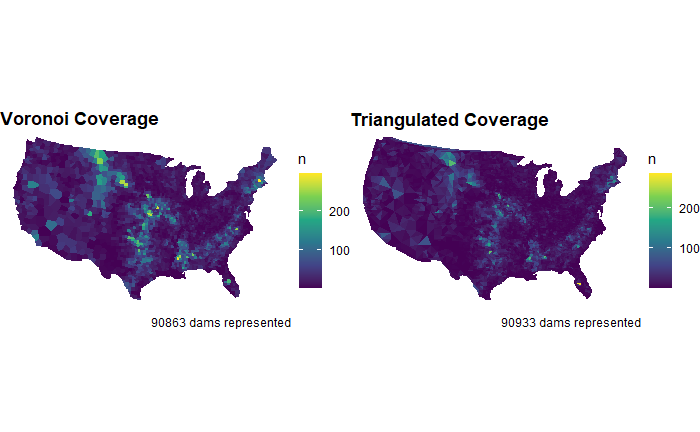

# {.tabset .tabset-fade}

```{r library, include=FALSE, message=FALSE, warning=FALSE}
library(tidyverse)
library(leaflet)
library(sf)
```


## Previous Work
***
> ## [Creating a FIM with Flood Data from Mission Creek](https://catherinerauch.github.io/geog-176A-labs/lab-06.html)
```{r, echo=FALSE, out.width="40%",out.height="30%",fig.cap="  ",fig.align='left'}
knitr::include_graphics(c("img/lab06plot.png"))
```

- Estimated the number of buildings impacted in the 2017 Santa Barbara flood

- This terrain data was prepped for analysis by aligning object and field data

- Data was loaded into R using Web APIs and the whitebox frontend was used to create a partial Flood Inudation Map (FIM) with structural damage assessment


***

> ## [Examination and Visualization of 2016 Palo, Iowa Flood Data](https://catherinerauch.github.io/geog-176A-labs/lab-05.html)
```{r, echo=FALSE, out.width="40%",out.height="30%",fig.cap="  ",fig.align='left'}
knitr::include_graphics(c("img/lab5plot.png"))
```

- Created multiband raster files to detect/analyze a flood event

- Raster manipulation was used to threshold and classify data to be analyzed

- Flood data from 2016 Palo, Iowa was graphed and examined

***

> ## [Impact of the MAUP on National Dam Inventory data](https://catherinerauch.github.io/geog-176A-labs/lab-04.html)
```{r, echo=FALSE, out.width="50%",out.height="40%",fig.cap="   ",fig.align='left'}

```

- Examined the impacts of different tessellated surfaces and the modifiable areal unit problem (MAUP) 

- Point-in-polygon counts were calculated to aggregate point data and visualize the distribution of dams over the US

- Functions were written to more efficiently report and map information

***

> ## [Exploration of US city data](https://catherinerauch.github.io/geog-176A-labs/lab-03.html)
```{r, echo=FALSE, out.width="50%",out.height="40%",fig.cap="   ",fig.align='left'}
knitr::include_graphics("img/CopyofUSthememap.jpg")
```

- Explored working with sf, sfc, and sfg features & objects

- Coordinate transformations and calculations were made to visualize distances between cities and borders

- Ggplot, gghighlight, and ggrepel were used to create graphics that are clear and interesting 

***

> ## [Analysis of COVID-19 data](https://catherinerauch.github.io/geog-176A-labs/lab-02.html)
```{r, echo=FALSE, out.width="40%",out.height="30%",fig.cap="  ",fig.align='left'}
knitr::include_graphics("img/Copyofcovidplot.jpg")
```

- Data wrangling and visualization with real-time COVID-19 data

- It includes an in-depth look at daily new case data as well as cumulative data at State and County levels

- Pipes and other tidyverse tools were used to manipulate data and present it as legible tables and plots


***


